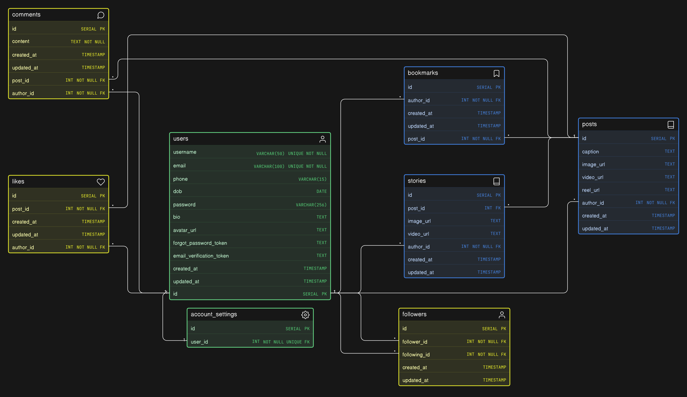

# Instagram - Database Design

---

## 📌 Overview

This database design models the core functionality of a social media platform similar to Instagram. It supports user authentication, content creation (posts and stories), social interactions (likes, comments, follows, bookmarks), and user account management.

---

## 🔗 Eraser Whiteboard

👉 View the interactive diagram: **[Open in Eraser](https://app.eraser.io/workspace/7uH6kXCTYXfXBLrRQszo)**

---

## 🧠 ER Diagram Preview

---

## 🧾 Schema Code

The schema is written using **Eraser DSL (diagram-as-code)**.

👉 View the file here: **[schema.eraser](./schema.eraser)**

You can open and edit it using Eraser:

- Go to https://app.eraser.io
- Create a new diagram
- Paste the contents of `schema.eraser`

---

## 🏗️ Design Highlights

## 🏗️ Design Highlights

### 1. Centralized User Model

- Single `users` table handles authentication and profile-related data
- Stores essential fields like username, email, password, bio, and avatar
- Referenced by all interaction and content tables

---

### 2. Dedicated Tables for Social Interactions

- `likes`, `comments`, and `bookmarks` are modeled as separate entities
- Each interaction links a user (`author_id`) with a post (`post_id`)

---

### 3. Follow System via Self-Referencing Table

- `followers` table connects users through `follower_id` and `following_id`
- Each row represents a single follow action

Key design decisions:

- Uses two foreign keys pointing to `users`
- Cleanly models directional relationships (who follows whom)
- Supports efficient queries for followers and following lists

---

### 4. Separation of Posts and Stories

- `posts` represent persistent content
- `stories` represent temporary or ephemeral content

Key design decisions:

- Stories stored independently to support expiry-based logic
- Optional `post_id` in stories allows resharing posts
- Flexible media fields for different content formats

---

### 5. Account Settings Isolation

- `account_settings` has a one-to-one relationship with `users`
- Keeps configuration data separate from core user data

Key design decisions:

- Prevents bloating the `users` table
- Allows easy extension of settings without impacting core schema

---

### 6. Consistent Audit Fields

- All major tables include `created_at` and `updated_at`
- Ensures traceability and supports sorting, filtering, and analytics

---

## ⚙️ Key Relationships

- `users -> posts` (1:M)
- `users -> stories` (1:M)

- `users -> comments` (1:M)
- `posts -> comments` (1:M)

- `users -> likes` (1:M)
- `posts -> likes` (1:M)

- `users -> bookmarks` (1:M)
- `posts -> bookmarks` (1:M)

- `users -> followers` (1:M via follower_id)
- `users -> followers` (1:M via following_id)

- `posts -> stories` (1:M, optional via post_id)

- `users -> account_settings` (1:1)
