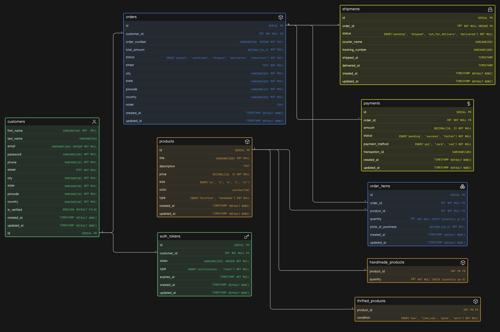

# Thrift & Handmade Store - Database Design

---

## 📌 Overview

The goal of this design was to model a **real-world business scenario** where:

- Some products are **thrifted (unique, single quantity)**
- Some products are **handmade (multiple quantity)**
- Orders, payments, and shipments must be tracked properly
- Customer data and authentication flows are handled cleanly

The schema is designed with **scalability, normalization, and real-world constraints** in mind.

---

## 🔗 Eraser Whiteboard

👉 View the interactive diagram: **[Open in Eraser](https://app.eraser.io/workspace/cTZov8anvDduYqOrynvB)**

---

## 🧠 ER Diagram Preview

---

## 🧾 Schema Code

The schema is written using **Eraser DSL (diagram-as-code)**.

👉 View the file here: **[schema.eraser](./schema.eraser)**

You can open and edit it using Eraser:

- Go to https://app.eraser.io
- Create a new diagram
- Paste the contents of `schema.eraser`

---

## 🏗️ Design Highlights

### 1. Product Modeling (Thrifted vs Handmade)

- Used **subtype modeling (table inheritance pattern)**:
    - `products` → base table
    - `thrifted_products` -> for unique items (with `condition`)
    - `handmade_products` -> for stock-based items (with `quantity`)

---

### 2. Order System (Core of E-commerce)

- `orders` -> stores order metadata
- `order_items` -> resolves **many-to-many relationship** between orders and products

Key design decisions:

- Stored `price_at_purchase` to avoid future price inconsistencies
- Added `UNIQUE(order_id, product_id)` to prevent duplicate entries

---

### 3. Payments & Shipments Separation

- `payments`:
    - Supports multiple attempts (failed, retry, etc.)
    - Tracks method and transaction info

- `shipments`:
    - Tracks delivery lifecycle
    - Includes `shipped_at` and `delivered_at` timestamps

---

### 4. Address Handling

- Customer address stored for convenience
- **Order address snapshot stored separately** to preserve historical accuracy

---

### 5. Authentication System

- Separate `auth_tokens` table for:
    - email verification
    - password reset

- Supports:
    - multiple tokens
    - expiry-based logic

---

### 6. Data Integrity & Constraints

- Used:
    - `UNIQUE` constraints (email, tokens, order_number, etc.)
    - `CHECK` constraints (quantity rules)
    - `ENUM` for controlled values

- Designed with:
    - **state tables** (customers, products, orders)
    - **event tables** (payments, tokens)

---

## ⚙️ Key Relationships

- `customers -> orders` (1:M)
- `orders -> order_items` (1:M)
- `products -> order_items` (1:M)
- `orders -> payments` (1:M)
- `orders -> shipments` (1:1)
- `products -> subtype tables` (1:1)
