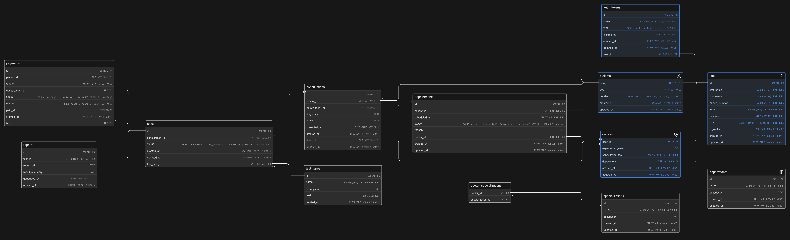

# Clinic Appointment and Diagnostics Platform - Database Design

---

## 🔗 Eraser Whiteboard

👉 View the interactive diagram: **[Open in Eraser](https://app.eraser.io/workspace/haX4b4xF3cm5o0s3DNIZ)**

---

## 🧠 ER Diagram Preview

---

## 🧾 Schema Code

The schema is written using **Eraser DSL (diagram-as-code)**.

👉 View the file here: **[schema.eraser](./schema.eraser)**

You can open and edit it using Eraser:

- Go to https://app.eraser.io
- Create a new diagram
- Paste the contents of `schema.eraser`
