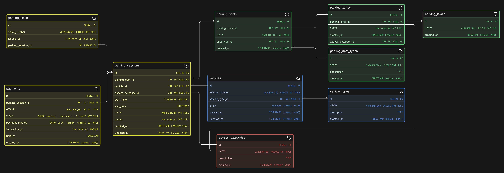

# Comic-Con Parking System - Database Design

---

## 📌 Overview

The Comic-Con Parking System is designed to efficiently manage a large-scale, multi-zone parking facility during high-traffic events. It supports multiple vehicle types, structured parking across levels and zones, reserved access for special categories (VIP, staff, exhibitors, etc.), and real-time tracking of parking sessions.

---

## 🔗 Eraser Whiteboard

👉 View the interactive diagram: **[Open in Eraser](https://app.eraser.io/workspace/pxHIhc15NLZeRxBhT03b)**

---

## 🧠 ER Diagram Preview



---

## 🧾 Schema Code

The schema is written using **Eraser DSL (diagram-as-code)**.

👉 View the file here: **[schema.eraser](./schema.eraser)**

You can open and edit it using Eraser:

- Go to https://app.eraser.io
- Create a new diagram
- Paste the contents of `schema.eraser`

---

## 🏗️ Design Highlights

### 1. Separation of Static vs Transactional Data

- Static entities like `vehicle_types`, `parking_spot_types`, `parking_levels`, and `access_categories` define system configuration
- Dynamic entities like `parking_sessions`, `parking_tickets`, and `payments` capture real-time operations
- Ensures scalability and avoids data duplication

---

### 2. Vehicle-Centric Identity Model

- `vehicles` table uniquely identifies vehicles using `vehicle_number`
- Supports multiple visits through `parking_sessions`
- Avoids unnecessary user/account abstraction for a transient event system

---

### 3. Multi-Level Parking Hierarchy

- Structured as:

```
parking_levels -> parking_zones -> parking_spots
```

- Enables logical grouping of parking areas
- Supports reserved zones (VIP, staff, etc.) and efficient navigation

### 4. Access Control via Categories

- `access_categories` define visitor types (VIP, general, staff, etc.)
- Linked to both:
- `parking_zones` -> defines zone purpose
- `parking_sessions` -> captures actual visitor type per entry
- Allows flexible access handling while preserving event-level truth

---

### 5. Parking Sessions as Core Entity

- `parking_sessions` act as the central transactional entity
- Stores:
    - vehicle
    - assigned spot
    - access category
    - entry (`start_time`) and exit (`end_time`)
- Enables tracking of active vehicles and historical visits

---

### 6. Ticket Abstraction for Entry/Exit

- `parking_tickets` provide a user-facing identifier for each session
- Maintains a 1:1 relationship with `parking_sessions`
- Decouples internal data from external references

---

### 7. Payment Tracking per Session

- `payments` are linked directly to `parking_sessions`
- Captures:
    - amount
    - payment method
    - transaction details
- Supports clear billing per visit

---

### 8. Spot Type Classification

- `parking_spot_types` define categories like small, medium, large, EV
- `parking_spots` reference these types to support structured allocation

---

## ⚙️ Key Relationships

- `vehicles -> parking_sessions` (1:M)
- `vehicle_types -> vehicles` (1:M)

- `parking_levels -> parking_zones` (1:M)
- `parking_zones -> parking_spots` (1:M)

- `parking_spot_types -> parking_spots` (1:M)

- `access_categories -> parking_zones` (1:M)
- `access_categories -> parking_sessions` (1:M)

- `parking_spots -> parking_sessions` (1:M)

- `parking_sessions -> parking_tickets` (1:1)

- `parking_sessions -> payments` (1:M)
